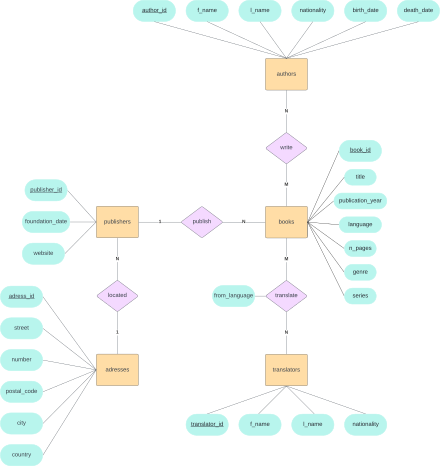

# Book inventory Database

This is a simple book inventory database, written in [SQL](https://en.wikipedia.org/wiki/SQL) and tested with [MySQL](https://dev.mysql.com/).

The ER diagram of the database is the following:

## Scripts

- `book_inventory_schema.sql` is used to generate the database schema.
- `book_inventory_triggers.sql` is used to create some example triggers to check for duplicate entries in the **authors** and **adresses** tables.
- `fill_book_inventory.sql` is used to fill the database with some example values.

## Usage

MySQL server or some other [DBMS](https://en.wikipedia.org/wiki/Database) needs to be downloaded and installed.

The scripts can then be used either by pasting the code in some SQL editor, or by sourcing them in the mySQL terminal line:

``
mysql> source path/to/book_inventory_schema.sql
``
